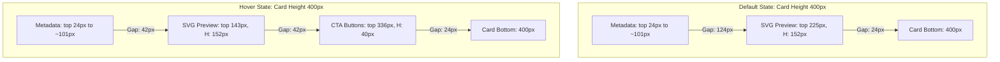

# Project Architecture & Design System Reference: Fonts Gallery

This document serves as a layout, design system, and implementation reference for other AI agents and developers working on the Fonts Gallery page (`/fonts`).

---

## 1. Card View Layout Specs & Metrics

The `/fonts` page renders font cards in a grid layout (Card View) and a list layout (List View). The specifications below apply strictly to the **Card View**.

### Card Box Dimensions
* **Width:** Flexible (computed at `172px` up to `332px` based on responsive viewport widths).
* **Height:** Fixed at `400px`.
* **Background Color:** `#efefef` (default state) / `#000000` (hover state).

### Preview Vector Positioning (Default vs. Hover)
Previews are positioned absolute inside the card and transition smoothly along the vertical axis using a standard cubic bezier ease: `transition: top 0.3s cubic-bezier(0.16, 1, 0.3, 1) !important;`.

---

## 2. Preview Vector Architecture

Dynamic font rendering is decoupled from browser-native text matching to ensure consistent visualization, zero layout shifts, and clean vector imports into Figma.

### Path-Only Guarantee
* Previews contain **no HTML text elements** and **no SVG `<text>` nodes**.
* Every card renders pure `<path>` elements within a container matching the aspect ratio of the raw reference frame.
* Scaled coordinates are pre-calculated to fit inside a standard `viewBox="0 0 238 151"`.

### SVG Files Mapping
Static pre-compiled SVG assets are stored in `src/assets/` and resolved inside `src/components/font-preview/AaPathPreview.jsx`:

| Font Card Name | Google Font Family | Target SVG Asset |
| :--- | :--- | :--- |
| **Neue Montreal** | `Inter` (Arimo equivalent) | `neue-montreal-aa.svg` |
| **PP Fragment** | `Playfair Display` | `pp-fragment-aa.svg` (Figma reference) |
| **Right Grotesk** | `Space Grotesk` | `right-grotesk-aa.svg` |
| **Mori** | `Gothic A1` | `mori-aa.svg` |
| **Pangram Sans** | `Plus Jakarta Sans` (Open Sans equivalent) | `pangram-sans-aa.svg` |
| **Formula** | `Bebas Neue` | `formula-aa.svg` |
| **Editorial New** | `Newsreader` | `editorial-new-aa.svg` |
| **Telegraph** | `Work Sans` | `telegraph-aa.svg` |

### Fill Behavior
To support background themes, the SVG paths use `fill="currentColor"`. When the card shifts colors on hover:
* Card text and paths automatically transition from black to white.
* Card background transitions from grey/white to black.

---

## 3. Pagination Styling Specs

To prevent browser-native agent stylesheet button overrides:
* **Target Elements:** Previous button (`.pg-prev`), Next button (`.pg-next`), and active/inactive page numbers (`.pg-num`).
* **Enforced Typography:** `font-family: 'PolySans Neutral', 'PolySans Trial', sans-serif !important;`
* **Weight Configuration:** Enforced `font-weight: 700 !important;` for maximum legibility.
* **Layout Shape:** numbers are circular (`border-radius: 50%;`), and navigation controls are pills (`border-radius: 9999px;`).

---

## 4. Safety Constraints for Future Agents
> [!IMPORTANT]
> Do not modify the positioning coordinates (`top: 225px` and `top: 143px`) or scaling bounds of the preview vectors. Doing so will break the pixel-perfect alignment with the Figma design frame.
> 
> List View must remain completely untouched. All modifications should be restricted to `viewMode === 'grid'` card rendering.
